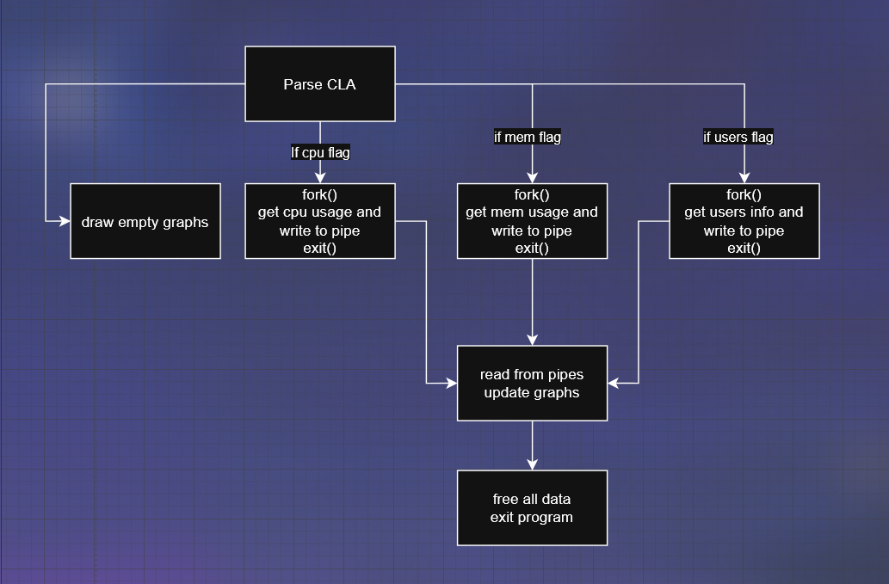

## System Monitoring Tol

## Metadata
   * Author: Arvindh Sengu
   * Date: April 7 2026
   * Release/Version: 1.0

## Introduction/Rationale
Wrote a c program that reported the different metrics (cpu usage, mem usage, current users/sessions) of a linux system. The information is displayed through graphs in the linux terminal where the user can select which graphs they want displayed (cpu, mem, users, which sepcifically like if they want all 3 or just 2 or just 1) and how many samples of data are collected as well as how often (tdelay) using command line args.

Now, we are tasking with refactoring this project to add concurrency (multiple processes, one for mem, one for cpu, one for users) and pipes to communicate between them as well as signal handling (ignore ctrl + z, prompt user to cancel when ctrl + c).

## Description of how you solve/approach the problem
So I first research how to actually get the data necessary to display on the graphs. The memory usage was pretty straightforward, I just used the /proc/meminfo file to subtract the total memory by the available memory to give me the memory usage in gb. For the cpu, I used to /proc/stat file, but there's not really a straightforward way of finding the cpu usage. So then by doing research I figured out that if you store the current cpu stats in the file and the stats after a few microseconds (tdelay), you can find out the cpu usage by dividing the difference of all the stats by the idle difference. For the sessions/users I imported a library that can read and format the utmp files on a linux machine as reading directly from the file gives me lots of useless info and weird symbols that are difficult to store/format. I used to a loop that goes through every user and terminal. Once I figured out how to get the info, I started working on parsing the command line arguments. So I built a loop that would loop through each argument besides the first one. It would first check if the CLA was in the first or second slot after the ./"program name" argv, and if it was in the first slot it would check if the integer was above 0 and set it equal to samples, same for the 2nd slot and if any of them were negative then it would crash the program and warn the user. Next, if any of the other --xxx flags were named then I would set a boolean value assigned to the flag equal to 1 and if the user mispelled memory or anything or entered some random flag I would crash the program and give them a warning. So after I finished parsing the flags and the collecting the data, I began working on displaying the data with escape codes and storing the lines of each graph for reference. I then made if statements and loops for each CLA flag case and then looped to update the graphs sample amount of times and tdelay wait time between each loop. I flushed the screen after each loop to make sure it worked.

For concurrency, I watched a video playlist on youtube about fork and how to communicate between processes using pipes. I also read up on documentation for those libraries. I chose to use fork in my main.c file and then to make things simple, I would make functions for each child process to follow that was specific to its use (so child_cpu for cpu, etc). Then I just ran a for loop that would sleep each tdelay and collect the required info from the computer by reading the same files as I did in A1. Then I used pipes to push and pull that information in my main loop. For signal handling, I used a library that allowed me to edit what each signal did, and so for ctrl + z, I just made it do nothing and for ctrl + c I made it print out a prompt to stdout and it would scan the user's choice (y or n) and act accordingly.

## Implementation
i. Describe first in sentences how did you implement your code.
1. Parsing CLA's from user and the the corresponding flags
2. Fork the necessary child processes and draw the empty graphs
3. Push and pull data from the fork and update the graphs according to tdelay and samples
4. Free everything and exit program

ii. The modules you created and functions within them.
child.h:
void child_users(int fd, int samples, int tdelay)
void child_memory(int fd, int samples, int tdelay)
void child_cpu(int fd, int samples, int tdelay)

draw.h:
void draw_empty_memorygraph(int samples, int *currline, int *endline, double total, double curr)
void draw_empty_cpugraph(int samples, int *currline, int *endline, double curr)
void draw_empty_userschart(int *currline, int *endline)

update.h:
void update_memory_graph(int i, int mem_endline, int graph_offset, int curr_mem_line, double total_ram_gb, double curr_ram_gb)
void update_cpu_graph(int i, int cpu_endline, int graph_offset, int curr_cpu_line, double curr_cpu_usage)
void update_userschart(int users_endline, const char *users_str, int *currline, int len)

systool.h:
int is_integer(const char *str)
int ceil_fn(double value)
ssize_t read_full(int fd, void *buf, size_t count)
double get_total_memory(void)
double get_used_memory_gb(void)
void parse_args(int argc, char *argv[], int *cpuflag, int *memoryflag, int *usersflag, int *samples, int *tdelay)

iii. Describe the functions in sentences, e.g. this function does this and that and uses this and that sources, system calls, libraries, etc.
     DO NOT COPY the *documentation* from your code!

child_memory
This function runs in a child process and measures the system’s memory usage. It waits for a specified delay between each sample using usleep, retrieves the current memory usage through a helper function (get_used_memory_gb), and sends each value through a pipe using the write system call. After collecting the required number of samples, it closes the pipe file descriptor and terminates the process using exit.

child_cpu
This function monitors CPU usage over time by reading raw CPU statistics from the /proc/stat file. It first records an initial snapshot of CPU time values, then repeatedly sleeps for a given interval and reads updated values. It computes CPU usage based on the difference between total time and idle time across samples, and writes the percentage to a pipe using write. The function relies on file I/O (fopen, fscanf, fclose), and exits after sending all samples.

child_users
This function collects information about currently users by accessing system session records via the utmp interface. For each iteration, it pauses using usleep, then iterates through user session entries using functions like getutent. It formats relevant details (such as username, terminal, and host) into a buffer using snprintf, then sends the size of the data followed by the actual content through a pipe. After repeating this process for the specified number of samples, it closes the pipe and exits.

draw_empty_memorygraph() & draw_empty_cpugraph() & draw_empty_userschart
These functions start the terminal display with empty graph templates. They print axis labels and placeholder characters that will later be filled with data points. They use ANSI escape sequences for cursor positioning and calculate graph dimensions based on the specified sample count. Empty users chart just draws a bunch of --- on top and below of "## Sessions... ###".

get_total_memory() & get_used_memory_gb()
These functions retrieve memory information by parsing /proc/meminfo. They read MemTotal and MemAvailable values in kilobytes, convert them to gigabytes, and calculate either total RAM or current usage. They use file I/O and string parsing functions to read and interpret the system data.

parse_args()
This cfunction handles various CLA's. It validates integer inputs using is_integer(), sets configuration flags for CPU, memory, and user display options, and establishes which graphs, how many samples, how much tdelay. It provides error messaging for invalid inputs.

is_integer()
A validation function that checks whether a string represents a valid integer using strtol(). It handles edge cases like empty strings, overflow conditions, and trailing non-numeric characters by examining the conversion result and error state.

ceil_fn
This function computes the ceiling of a floating-point number by casting it to an integer and checking whether there is any fractional part. If the value is not already an integer, it returns the next largest integer.

read_full
This function ensures that a specified number of bytes are read from a file descriptor by repeatedly calling read until the requested amount is obtained or an error occurs. It keeps track of the total bytes read.

update_memory_graph() & update_cpu_graph()
These functions update the graphs in real-time. They calculate the vertical position for each data point based on the current value, then use escape codes to plot coordinates. They use the system's current memory or CPU readings to determine plot positions.

update_userschart()
This function displays active user sessions by reading the system's user accounting database using the utmpx/utmp API. It calls setutent(), getutent(), and endutent() to iterate through user records, filtering for login processes. It formats and displays username, terminal, and host information for each active session.

### Include a pseudo-code of your code.
1. Parsing CLA's from user and the the corresponding flags
2. Fork the necessary child processes and draw the empty graphs
3. Push and pull data from the fork and update the graphs according to tdelay and samples
4. Free everything and exit program

### Include a flow chart or diagram of your program and corresponding functions' calls.

Refs.
    https://www.geeksforgeeks.org/what-is-pseudocode-a-complete-tutorial/
    https://en.wikipedia.org/wiki/Flowchart 
    https://draw.io

## Instructions in how to compile your code
make
./systool

To re-compile:
make clean
make ./systool

## Expected Results
Without any CLA's it should output all 3 graphs at 20 samples at tdelay of 500000
With invalid CLA (invalid tags (--memmmory, --fsadklfjan, etc) or negative int values for samples and tdelay) it should crash and warn the user
With CLA's for samples and tdelay that are repeated, the program will prioritize --samples and --tdelay and disregard the first 2 slots --> If the user types -20 --samples=20 it will still crash
With specific CLA's like --memory, etc the program should run the specified graphs only

## Test Cases
If using a mistaken CLA: will crash and warn the user
I ran testcases that included different sample sizes and tdelay sizes with no other flags to test runtime: will work fine
I ran diffeent sizes and tdelays for only one graph and every combo of 2 graphs: will work fine
I did the same with having 2 different sample sizes and 2 different tdelays(I ran something like ./a.out 20 1000000 --memory --users --samples=15 --tdelay=2000000 for each combination of flags): will work fine
I ran each of the above will using the make_computer_work program to stress mem/cpu and i added and removed users at the same time: will work fine

## Disclaimers
Anything that must be disclaimed about your code.
E.g. my code will fail if the among of memory available on the system is less than 4GB.

-std=c99 will not compile my code, because usleep is not included
My code will fail if the memory and cpu do not meet the required threshold for a linux OS.
My code will fail if the user is not running it on a linux machine.

## References
https://www.upgrad.com/tutorials/software-engineering/c-tutorial/format-specifiers-in-c/
https://www.linuxhowtos.org/System/procstat.htm
https://superuser.com/questions/609949/what-are-the-methods-available-to-get-the-cpu-usage-in-linux-command-line
https://www.reddit.com/r/linuxquestions/comments/2sblx4/what_is_the_difference_between_memfree_and/
https://www.tutorialspoint.com/c_standard_library/c_function_strtol.htm
https://pubs.opengroup.org/onlinepubs/7908799/xsh/pwd.h.html
https://user-create.hashnode.dev/user-creation-and-set-as-default-in-wsl
https://www.youtube.com/watch?v=Ps-KajI0asw&pp=ygUHc3ByaW50ZtIHCQnZCgGHKiGM7w%3D%3D
https://www.youtube.com/playlist?list=PLfqABt5AS4FkW5mOn2Tn9ZZLLDwA3kZUY
(All references listed in the quercus page of A1 & A3)
(Pacos A48 notes)
(PCRS vids)
